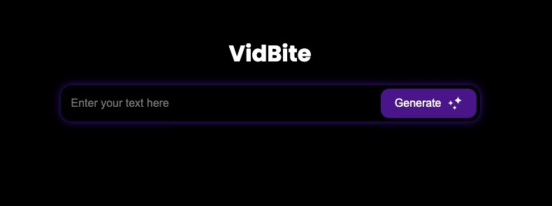

<!-- <p align="center">
  
</p> -->
 
<!-- This will work when you make the repo public -->

<h1 align="center">VidBite</h1>

<p align="center">
  🤖 Claude Sonnet 3.5 powered generative videos. Concept. 
</p>



<!-- ## Table of Contents
- [Concept](#concept)
- [Usage](#usage)
- [Models Used](#models-used)
- [Demo Video](#demo-video) -->

## 🧠 Concept


Inspired by the educational style of 3Blue1Brown's videos, VidBite aims to revolutionize the way mathematical and scientific concepts are visualized by automating the generation of custom Manim code and videos. Our application leverage modern-day LLMs to produce high-quality and dynamic visualizations of concepts tailored to specific user needs. 

Users input their mathematical or scientific concepts into the application, which then utilizes powerful AI models to generate corresponding Manim code. This code can be further customized and is ready to be rendered into high-quality animations.

<video width="640" height="360" controls>
  <source src=".github/Demo_ChatGPT.mp4" type="video/mp4">
  Your browser does not support the video tag.
</video>


## Usage (Development)
To use VidBite:

1. Run the server:
    ```bash
    python3 -m backend.server
    ```
2. Run the frontend:
    ```bash
    cd extension
    npm install
    npm start
    ```

## Models Used
| Model                       | Description                                                                 | Status  |
|-----------------------------|-----------------------------------------------------------------------------|---------|
| Claude 3.5 Sonnet (Paid)    | Powerful language model for generating precise Manim code with enhanced performance and latest features.  | ✅      |
| Google Gemini (Unpaid)      | Efficient language model for generating Manim code, complementing Claude 3.5 Sonnet with versatile functionality. | ✅      |


